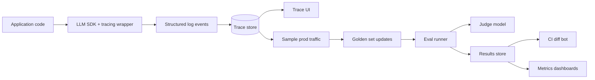

# 7. 工具与平台

这一节比本章其他内容过期得快。基本盘——golden set、judge 校准、regression 纪律、结构化日志——五年后还是一样。具体工具不会一样。把这页当成方向感，不是背书。

实话先说：**工具远没有"有这套纪律"重要。**一个目录的 JSONL golden case、一个跑它们的 Python 脚本、一份结果 CSV、一个把 diff 推到 Slack 的 cron——对很多团队这就够了。别让"我们得选个平台"成为你不去做评估的借口。

我们点名三个选项，每个对应一种姿态，再用一两句话扫一下其他的。

## 三种选项，三种姿态

### Langfuse——开源、可自部署，eval + 可观测性 + prompt 一体

[langfuse.com](https://langfuse.com)，Apache 2.0 协议，也提供托管版。

**它是什么。**给 LLM 调用做 trace（带父子 span）、从生产 trace 里搭数据集、跑 eval、管 prompt 版本、在 UI 里看每个 case 的结果。开源意味着你可以自己 host 在自己的基础设施上。

**什么时候选。**你想要 eval、可观测性、prompt 管理一体的工具，要么你有数据驻留约束，要么你不放心把对话交给某个 vendor。自部署不简单但可行；托管版对多数团队也够用。

**毛刺。**UI 是广而不深的——某些视图你迟早会嫌不够用。自部署的 Postgres 在高流量下会成瓶颈。Prompt 管理如果你不小心，会和你的代码仓库飘开（见 [第 2 章 §3](../llm-apis-and-prompts/prompt-as-code) 的 prompts-as-code）。

### Braintrust——商业、eval 优先、"GitHub for prompts" 风格

[braintrust.dev](https://braintrust.dev)，商业、仅托管。

**它是什么。**eval 为中心的平台。diff prompt 版本、并排看每个 case 的结果、对比两次 run 的 UI 都很顺。和 judge 函数及 CI 工作流结合得紧。

**什么时候选。**你的瓶颈是 eval 工作流，不是可观测性。你想要一份工程师或 PM 不用培训就能用的精致 UI。你能接受把对话发给 SaaS vendor。

**毛刺。**闭源；你依赖一个 vendor。按席位 + 按事件计价；预算要算。生产 tracing 比专门的可观测性工具弱一些。

### OpenTelemetry + 自己的看板——"无平台"路线

[opentelemetry.io](https://opentelemetry.io)，开放标准，可发到任何后端。

**它是什么。**分布式 tracing 的一套标准，2025 年起带 GenAI 语义约定。Instrument 一次，指向任何兼容后端（Honeycomb、Grafana Tempo、Datadog、Jaeger 等等）。

**什么时候选。**你已经在非 LLM 服务上有可观测性基础设施，希望 LLM tracing 跟其他东西放一起。你想避开单独的 vendor 和单独的看板文化。

**毛刺。**OTel 给你 tracing；eval 是你自己的事。你得自己滚一个 runner（一个 Python 脚本扫 golden set，调用和生产同一份 SDK）。UI 不是 LLM 专用的——你会在一个为 HTTP 请求设计的后端里读 trace，能用，但不是为这件事量身做的。

## 一目了然的对比

| 维度                  | Langfuse              | Braintrust            | OTel + 自己搭                          |
|---|---|---|---|
| Eval runner           | 内置                  | 内置（强）             | DIY                                    |
| LLM tracing           | 内置                  | 内置                   | 标准，vendor 灵活                      |
| Prompt 管理           | 内置                  | 内置                   | DIY                                    |
| 成本                  | 免费（自部署）/ 按量计费（云） | 按席位 + 按事件 | 你的 tracing 后端的成本                |
| 锁定                  | 低（开源）            | 中（vendor）           | 低（标准）                             |
| 自部署                | 是                    | 否                     | 是                                     |
| 最适合                | 一体化、偏好 OSS      | eval 为中心的工作流    | 已经 instrument 过的团队                |

## 也存在，每个一行

- **Phoenix（Arize）**——开源 LLM tracing 和 eval，数据集和 trace 检查很强。
- **LangSmith**——LangChain 的官方平台；你押注那套 stack 时有用。
- **Weights & Biases**——历史上以训练为主；他们的 LLM eval 产品如果你已经用 W&B 跑实验也凑合。
- **Helicone、Traceloop**——以可观测性为主。
- **Ragas、Trulens**——eval 库（[第 3 章 §7](../embeddings-and-rag/evaluating-rag) 提到过），可以接到任何平台上。

按名字搜就行。两个名字加 "LLM eval"，足以查到任何一个的当前状态。

## 平台都在做什么（这样你能自己滚）

如果你理解一个平台在做什么，需要的时候你能用一个长下午搭出等价物。核心组件：

具体说：

- 一个**绕你 LLM SDK 的 tracing wrapper**，负责发结构化事件（[§6](./observability)）。
- 一个 **trace store**——可以就是你现有的日志存储。
- 一个 **golden-set runner**——一个脚本读 JSONL、跑每个 case、应用指标、写结果（[§5](./online-vs-offline) 那段 Python 大致就是它了）。
- 一个 **judge harness**——pydantic + 结构化输出（[§4](./llm-as-judge)）。
- 一个 **diff 函数**——旧指标减新指标、阈值、构建失败。
- 一个**看板**——Grafana、Metabase、Hex，任何能讲 SQL 的。

两个工程师一周能搭出来。用平台的团队一个下午能立起来，省下来的时间用来做产品。两条路都对；错的是连这些组件都没有。

## 什么时候该换工具

三个信号说明你已经撑不住"电子表格 + 脚本"：

1. **你不止一个产品面在跑评估。**跨团队共享基础设施时，平台开始划得来。
2. **非工程师想看结果。**PM 和设计师需要一个能用鼠标点的 UI。CSV 撑不到一个五人小组。
3. **你需要回放。**"把一年前这个 case 上的这条 prompt 和这个模型完全重跑一次"是规模化交付 LLM 功能后真实存在的工作流。平台让回放更容易；自己滚的版本会渐渐让你头大。

反过来，三个信号说明你**不**该急着上平台：

1. **你还没有 golden set。**平台不会帮你建。先建集合，再选工具。
2. **你不信任你的 judge prompt。**先跟人工校准（[§4](./llm-as-judge)）。再上平台。
3. **你选平台是为了感觉自己有进度。**这是拖延。用你手上的脚本去跑你手上的 case。

## Stack 上的立场，2026

如果非要给一个推荐：**从一个 Python 脚本 + JSONL + 你现有的日志存储开始。等你想要一个真正的 UI 又不想依赖 vendor 时加 Langfuse；等你瓶颈在 eval 工作流速度、且你能接受 SaaS 时加 Braintrust。**当 LLM tracing 是你已经成熟的可观测性体系里的一块时，OpenTelemetry 是对的答案。

本章教的纪律才是关键。工具是可替换的。

下一节: [结语 →](./closing)
