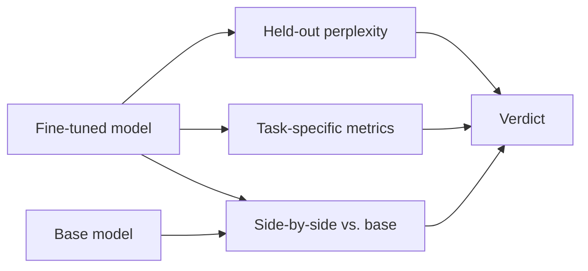

# 5. 评估微调结果

训练跑完了。Loss 在降。那现在的问题是：微调真的把模型变好了吗？

如果你不严肃回答这个问题，你就是在闭眼飞行。训练集 loss 在降是必要条件，但远远不充分。模型完全可能在死记你那 200 条样本，同时丢掉所有通用能力——loss 曲线两边看都很漂亮。

这一页讲的是能在生产里抓到真实微调问题的三个评估面，以及怎么把它们串起来。

## 三个评估面



### 1. 在留出 split 上的 loss / perplexity

便宜、自动、机械。训练前把数据按 95/5（或 90/10）切开，eval split 永远不让 trainer 碰到。每个 epoch 之后在 eval split 上算一次 loss。

它能抓到什么：明显的过拟合（train loss ↓ 而 eval loss ↑），以及"训练到底有没有起作用"这种问题。

它抓不到什么：所有真正决定质量的东西。Perplexity 是个粗糙代理。一个对相同答案信心稍强的模型在 perplexity 上会变好看，但实际输出未必更好。别只靠 perplexity 上线。

`SFTTrainer` 在你传 `eval_dataset` 时会自动处理：

```python
training_args = SFTConfig(
    # ... other args
    eval_strategy="epoch",
    per_device_eval_batch_size=2,
)
trainer = SFTTrainer(
    model=model,
    args=training_args,
    train_dataset=train_ds,
    eval_dataset=eval_ds,    # add this
    tokenizer=tokenizer,
)
```

训练日志里会在 `loss` 旁多出一列 `eval_loss`。

### 2. 任务特定指标

任何真正贴合你任务的指标。例子：

| 任务 | 指标 |
|---|---|
| 分类 | 准确率、F1、各类别 precision/recall |
| 结构化抽取 | 字段级 exact match、schema 合法率 |
| SQL 生成 | 查询能否解析、执行匹配（这条查询返回的行和 gold 查询是否一致） |
| 工具调用微调 | JSON 合法率、function name 准确率、参数形态准确率 |
| 摘要 | ROUGE（粗），配一个 judge LLM |
| 开放生成 | 在双盲 judge eval 中相对基座的 win-rate（见 #3） |

前端开发者的直觉在这里是对的：**测不出来就重构不了**。微调是迭代的——你会做 5–10 轮才收敛到一个好的模型——而你在两轮之间唯一的信号就是固定 eval set 上的任务指标。先把 eval 建起来。

### 3. 两两对比基座——最重要的那个

这是真正决定生死的 eval：**在你真正在意的那些 prompt 上，你的微调输出比基座输出更好吗？**

机械模式：选 50–200 条 prompt，分别让基座和微调生成答案，再让一个更强的模型（前沿 API）当 judge 给每条 prompt 选一个赢家。汇总成 **win-rate**。

judge prompt 可以用结构化输出（[第 2 章 §5](../llm-apis-and-prompts/structured-output)）压成 `{"winner": "A" | "B" | "tie", "reason": "..."}` 这种干净 JSON。为了控制位置偏置，每条样本随机决定哪个模型是"A"哪个是"B"。

为什么这是最重要的 eval：
- 它直接回答"该不该上线"这个问题——perplexity 甚至任务指标都答不了。
- 它能抓到所有自动指标抓不到的行为（语气、格式合规、含糊其辞，等等）。
- 它能扩大规模：200 条 prompt 配一个 judge LLM，几分钱、几分钟。

## 永远要对比这三件东西

只有当微调在你的 eval set 上同时打赢下面三个 baseline 时，它才值得上线：

| Baseline | 它回答的问题 |
|---|---|
| **基座模型** | 微调到底有没有用？ |
| **只做 prompt 工程的基座** | 一个更好的 system prompt 是不是就能达到这里，省下训练？ |
| **更大 / 更强的指令模型**（比如前沿 API） | 你是不是微调微调成了比直接调 GPT/Claude 还差的版本？ |

跳过 baseline #2 你就会偶尔花两周微调出一个 100 token 的 system prompt 也能搞定的东西。跳过 baseline #3 你就会上线一个 3B 模型，质量明显比花 0.001 美元一次调用前沿 API 还差。

## 灾难性遗忘检查

微调会移动权重。如果推得太狠，权重会从基座原本拥有的通用能力上偏离——模型在你这个任务上变神了，但忘了基本推理、事实问答，甚至工具调用怎么做。

在 eval 里加一个小的"通用能力"集——20–50 条 prompt，覆盖：

- 基础事实问答（"巴西的首都是哪？"）
- 简单推理（"如果 A 比 B 高，B 比 C 高，谁最矮？"）
- 工具调用，如果你的模型需要（几条有代表性的 function-call prompt）
- 几条明显有害的 prompt 上的拒答行为（你不希望微调顺手把安全护栏拆了）

在**基座和微调上都跑一遍**。如果微调在基座能过的通用能力上挂了，你就有灾难性遗忘。缓解方法：

- 降学习率（试 `1e-4` 而不是 `2e-4`）。
- 减 epoch。
- 减 `r`（更低秩的 delta，覆盖容量更小）。
- 在微调集里掺通用数据——哪怕 10–20% 的通用 instruction-following 样本插进来都能帮很多（[第 10 章 §2](../post-training) 把这件事叫 PPO-ptx）。

## 一个最小的 `eval.py`

参考脚本：加载两个模型，在一份 `(prompt, optional gold)` 的 JSONL 上跑，输出对比报告。示意——judge 调用部分换成你用的服务商。

```python
# eval.py
import json
import torch
import random
from transformers import AutoModelForCausalLM, AutoTokenizer, BitsAndBytesConfig
from peft import PeftModel
# from openai import OpenAI   # judge model; swap for any provider you prefer

BASE = "Qwen/Qwen2.5-3B-Instruct"
ADAPTER = "./qwen3b-myftune-final"
EVAL_JSONL = "eval.jsonl"        # lines of {"prompt": str, "gold": optional str}

bnb = BitsAndBytesConfig(load_in_4bit=True, bnb_4bit_quant_type="nf4",
                         bnb_4bit_compute_dtype=torch.float16)
tok = AutoTokenizer.from_pretrained(BASE)
base = AutoModelForCausalLM.from_pretrained(BASE, quantization_config=bnb, device_map="auto")
ft = PeftModel.from_pretrained(
    AutoModelForCausalLM.from_pretrained(BASE, quantization_config=bnb, device_map="auto"),
    ADAPTER,
)

def gen(model, prompt: str) -> str:
    msgs = [{"role": "user", "content": prompt}]
    text = tok.apply_chat_template(msgs, tokenize=False, add_generation_prompt=True)
    inp = tok(text, return_tensors="pt").to(model.device)
    with torch.no_grad():
        out = model.generate(**inp, max_new_tokens=512, do_sample=False)
    return tok.decode(out[0][inp["input_ids"].shape[1]:], skip_special_tokens=True)

def judge(prompt: str, ans_a: str, ans_b: str) -> str:
    """Ask a judge model to pick a winner. Returns 'A', 'B', or 'tie'.
    Schematic — replace with your provider's structured-output call."""
    # client = OpenAI()
    # resp = client.chat.completions.create(model="gpt-4o-mini", ...)
    # return resp.choices[0].message.parsed["winner"]
    raise NotImplementedError("wire to your judge LLM")

results = {"base_win": 0, "ft_win": 0, "tie": 0}
records = []
with open(EVAL_JSONL) as f:
    for line in f:
        ex = json.loads(line)
        a_base = gen(base, ex["prompt"])
        a_ft   = gen(ft,   ex["prompt"])
        # randomize position to avoid judge bias
        if random.random() < 0.5:
            verdict = judge(ex["prompt"], a_base, a_ft)  # A=base, B=ft
            ft_won = verdict == "B"; base_won = verdict == "A"
        else:
            verdict = judge(ex["prompt"], a_ft, a_base)  # A=ft, B=base
            ft_won = verdict == "A"; base_won = verdict == "B"
        if ft_won:   results["ft_win"]   += 1
        elif base_won: results["base_win"] += 1
        else:        results["tie"]      += 1
        records.append({"prompt": ex["prompt"], "base": a_base, "ft": a_ft, "verdict": verdict})

print(results)
# Print example disagreements for manual review:
for r in records[:5]:
    print(r["prompt"][:80], "->", r["verdict"])
```

每次跑都把逐样本记录写到磁盘，方便抽查 judge 的判断。**在你相信总 win-rate 之前，至少手工读 20 条对比样本**。Judge LLM 是有偏见的（偏爱长答案、偏爱更自信的答案、偏爱位置 A 上的那个）；亲眼看过再相信整体数字。

## "好"长什么样

对一次真任务的真微调来说：

- **相对基座的 win-rate ≥ 60% 在你的 eval set 上**——否则微调不值得它带来的运维复杂度。
- **相对加 prompt 工程的基座 win-rate ≥ 55%**——如果一个更好的 system prompt 就能补 90% 的差距，那就直接发 system prompt。
- **通用能力集：相对基座没有回归。** 回归了就降低 lr 或减少 epoch 重训。
- **任务指标：明显比基座好。** 如果你的任务指标是 SQL 执行 exact match，基座 40%、微调 55%，那是真实的胜利。

## 承上启下

这一页是一个更大主题在微调上的具体实例。**第 11 章（评估与可观测性）** 把 eval 当作一门工程纪律来讲：黄金集、judge 模型校准、回归率追踪、离线 benchmark 和线上指标的差别。如果你要把微调过的模型上线给真用户，下一步读那一章。

下一节: [部署微调模型 →](./serving-finetuned-models)
