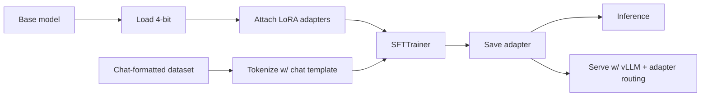

# 微调实战

在[第 3 章](../embeddings-and-rag/why-rag) 我们划过一条线：**微调用来改行为，RAG 用来加知识**。这一章是这条线的工程那一半——怎么端到端地实际微调一个模型，在你已经能用上的硬件上。

姊妹章节（[第 12 章](../post-training)）讲的是后训练的*理论*——SFT、DPO、RLHF、GRPO——停留在"这些算法为什么存在"这个层面。本章则一直坐在工程师的位子上：加载基座模型、挂上 LoRA adapter、按 chat 格式整理数据、在单张 GPU 上跑训练、评估、上线。锁定的样例是 **Qwen-3B 上跑 QLoRA**，能塞进免费的 Colab T4。同样的代码搬到更大的 GPU 上跑更大的模型也照样能用。

## 整条流水线一图看懂

图里每个方框都对应下面的一个小节。这里没有什么概念上新奇的东西——但每个方框都至少有一个会悄悄毁掉你训练的坑，本章讲的就是这些坑。

## 读完之后你应该能

- 判断微调到底是不是该用的工具（vs. RAG、prompt 工程，或干脆换个模型）。
- 把 LoRA 和 QLoRA 解释清楚到能自己挑 `r`、`alpha`、`target_modules`，而不是闭着眼睛抄。
- 准备一份 chat 格式的 SFT 数据集，并且和基座模型的 chat template 对得上。
- 在免费的 Colab T4 上端到端跑一次 Qwen-3B 的 QLoRA 微调，保存 adapter，再加载回去推理。
- 把微调后的模型和基座模型对比评估，识别出灾难性遗忘。
- 在生产环境里部署微调过的模型，包括"多 adapter 共一个基座"的多租户模式。
- 认出在生产环境会把你的微调吃掉的 8 个坑——上线之前每一条都得检查。

## 本章包含

1. [何时该微调](./when-to-fine-tune)——决策树：RAG vs. prompting vs. 换模型 vs. 微调。
2. [LoRA 与 QLoRA](./lora-and-qlora)——低秩 adapter 和 4-bit 基座量化背后的数学直觉。
3. [数据准备](./data-preparation)——chat template、loss masking、packing，以及那些压倒一切的数据坑。
4. [实战：Qwen-3B + QLoRA](./qwen-qlora-colab)——可运行的核心样例。六个 Colab cell，免费 T4。
5. [评估微调结果](./evaluating-the-finetune)——perplexity、任务指标、和基座模型的两两对比。
6. [部署微调模型](./serving-finetuned-models)——merge vs. adapter 感知部署；一个基座挂多个 LoRA。
7. [生产坑](./production-pitfalls)——你必然会踩的那些失败模式，以及怎么规避。

关于本章范围的一句话：本章是工程的。[第 12 章](../post-training) 是理论搭档——读那一章是为了搞清楚 *为什么* SFT 有效、DPO 和 GRPO 是什么、人类偏好数据是怎么走进训练流程的。这些东西本章不会再推一遍。

下一节: [何时该微调 →](./when-to-fine-tune)
