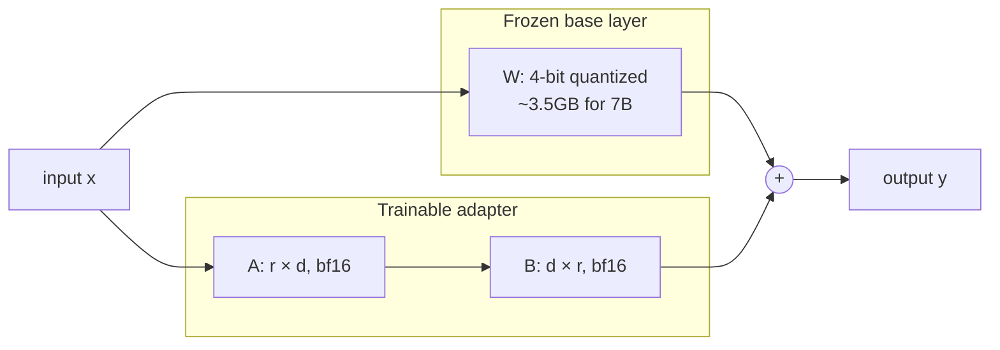

# 2. LoRA 与 QLoRA

要全量微调一个 fp16 的 7B 模型，光权重就要约 14GB 显存，再加上 Adam 的优化器状态约 28GB（`m` 和 `v` 缓冲区，各 fp32），再加梯度，再加激活值。现实里的下限是 ~80GB（[第 7 章](../gpu-and-model-sizing) 把这个数学走过一遍）。这意味着至少一张 A100，13B 要两张 H100，再大的模型就要小集群了。绝大多数人摸不到。

LoRA 和 QLoRA 是把这个数字拽到一张消费级 GPU 上的两个戏法。

## LoRA：训低秩 delta，而不是训整个权重

LoRA 背后的经验观察：当你在新任务上微调一个预训练模型时，任何权重矩阵的*变化量*近似是 **低秩** 的。你不需要去学一个完整的 `d × d` 更新——你可以学一个小得多的分解 `B @ A`，加到冻结的基座权重上。

```
full FT:  W_new = W + ΔW                 (ΔW: full d × d matrix)
LoRA:     W_new = W + B @ A              (A: r × d, B: d × r,  r << d)
                  ^^^^^^^^^
                  freeze W, train only A and B
```

具体到一个 7B 模型里某一层 attention projection 的数字（`d ≈ 4096`）：

```
full ΔW:   4096 × 4096 = 16.8 M params  (per matrix, in fp16: 33 MB)
LoRA r=16: 16 × 4096 + 4096 × 16 = 131 K params  (in bf16: 0.26 MB)
                                   ^ a 128x reduction
```

把这套操作在 7B 模型的每一层 attention 上重复一遍，可训练参数量就从几十亿降到了个位数百万级。基座权重是**冻结**的——梯度不流过它们，优化器状态不跟踪它们，推理时你既可以让 `B@A` 单独存在（方便切换 adapter），也可以把它合并回 `W`。

### 你真正要调的四个旋钮

| 旋钮 | 含义 | 起步默认值 |
|---|---|---|
| `r` | 分解的秩。r 越大 = 容量越大 = 参数越多。 | 大多数任务 `16`；小任务 `8`；难任务 `32+`。 |
| `alpha` | 缩放因子。delta 实际是按 `(alpha / r) * B @ A` 加上去的。有效学习率随它放缩。 | 一般取 `2 * r`，所以 `r = 16` 时 `alpha = 32`。 |
| `dropout` | LoRA 路径上的 dropout。在小数据集上有助于泛化。 | `0.05`。 |
| `target_modules` | 哪些权重矩阵挂 adapter。几乎总是 attention projection。 | LLaMA 系列 / Qwen 用 `["q_proj", "k_proj", "v_proj", "o_proj"]`。再加上 `["gate_proj", "up_proj", "down_proj"]`（MLP）能在难任务上进一步提升，参数大约翻倍。 |

一个对前端开发者好用的心智模型：`r` 是这个 diff 的"压缩秩"。低 r = 你在说"这次微调只是个小调整"；高 r = 你在说"这是个大规模的行为转变，给它多一点容量"。

## QLoRA：把冻结的基座量化成 4-bit

LoRA 解决了*可训练参数量*的问题。但训练时基座权重还是得以全精度躺在显存里——你得正向传播过它们。对于 7B 模型来说，这仍然是 14GB 你绕不过去的冻结权重。

QLoRA 的戏法：把冻结的基座权重用一种叫 **NF4**（Normal Float 4）的格式量化到 **4 bit**，以 4-bit 形式冻结存放，每次 matmul 时再实时反量化。LoRA adapter 自己以更高精度训练（bf16 或 fp16）。基座的量化误差按 QLoRA 论文的数据，大多数 benchmark 上只损失约 1% 精度——比微调本身带来的收益小得多。

7B 模型的内存账：

```
fp16 base weights:      7B × 2 bytes = 14.0 GB
NF4 base weights:       7B × 0.5 bytes ≈ 3.5 GB    (4x reduction)

Plus, regardless of base format:
LoRA adapters (bf16, ~0.5% of params):              ~70 MB
Adam optimizer state for adapters (fp32, 2x):       ~280 MB
Activations during forward + backward:              ~3-8 GB (depends on seq len, batch size)
KV cache + framework overhead:                      ~1-2 GB

Total fp16 base + LoRA training: ~25 GB  -> needs A100
Total NF4 base + LoRA training:  ~10-14 GB -> fits on a 16GB T4
```

而对于一个 **3B 模型**，NF4 权重只有约 1.5GB，即便序列长度拉长，16GB 的 T4 上也有大把余量。这就是为什么 Qwen-3B + QLoRA 这个组合是本章的标准样例——它是真正能训出有用模型的最宽松设置。



前向传播是 `y = x @ W + (x @ A.T @ B.T) * (alpha/r)`。`x @ W` 这一半在 matmul 那一刻把 4-bit 权重实时反量化成 fp16，算完就丢掉反量化结果。内存保持很低；算力开销和普通 LoRA 差不多。

## 权衡对照表

| 方法 | 显存（7B 训练） | 可训练参数 | 与全量 FT 的质量差 | 备注 |
|---|---|---|---|---|
| 全量微调 | 80GB+（A100 / 多卡） | 100%（~7B） | baseline | 最优但很少必要。 |
| LoRA | ~25GB（单张 A100） | ~0.1–1%（~5–70M） | 多数任务 1–2% 以内 | 显存足够时的标准选择。 |
| QLoRA | ~10–14GB（T4 / RTX 4090） | ~0.1–1% | 比 LoRA 再差 ~1% 以内 | 民主化的那一个。 |
| 8-bit LoRA | ~17GB | 同 LoRA | 基本等同 LoRA | QLoRA 出来之后用得少了。 |

主旨：**在大多数微调任务上，QLoRA 用不到 20% 的显存就能逼近全量微调的 ~2% 范围内**。剩下那 2% 几乎从来比不过下一节讲的数据质量差距。

## 你还会见到的其他 PEFT 方法

PEFT（参数高效微调）是一个不大不小的动物园。LoRA 是其中最常见的，但你会撞上：

| 方法 | 一句话总结 |
|---|---|
| **DoRA** | 把权重分解成幅度和方向，只对方向跑 LoRA。同等参数下比 LoRA 略好，略慢。 |
| **GaLore** | 把梯度而不是权重投影到一个低秩子空间。让你能以 LoRA 级别的内存做全量微调。较新，工业验证还不够。 |
| **AdaLoRA** | 给 LoRA 加预算——自动学习哪些层需要更高的秩。收益边际，复杂度加得不值。 |
| **Prefix / prompt tuning** | 训练一个挂在输入前面的"软 prompt"。便宜但在难任务上质量上限低。已经过气。 |

2026 年的 95% 场景，**答案就是 LoRA 或 QLoRA**。从这两个开始。

## 这件事对本章后面为什么重要

QLoRA 是一个有 Google 账号的开发者就能微调一个真 LLM 的根本原因。没有它，本章会变成一篇关于怎么租云上 GPU 的散文。有了它，后面四页都能在免费的 Colab T4 上跑起来。[第 7 章](../gpu-and-model-sizing) 有更宽的内存数学；这里的结论是：4-bit 基座 + LoRA adapter 是塞得下的那个配置。

下一节: [数据准备 →](./data-preparation)
