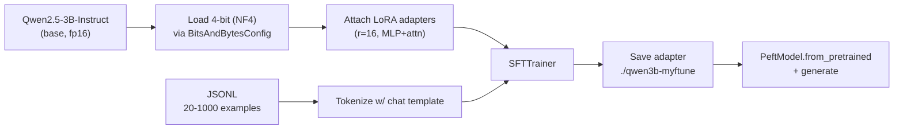

# 4. 实战：Qwen-3B + QLoRA 在免费 Colab T4 上

这一页是前面所有内容指向的地方。读完之后你会在免费 Colab T4 上端到端跑过一次真实的 QLoRA 微调——加载基座、挂上 adapter、整理数据、训练、保存、推理。Python 代码总共大约 250 行，六个 cell，在小玩具数据集上训练大约 15–25 分钟。

要在更大的任务上认真跑，把数据集换成你的，把 epoch / 训练步数加大就行。其他都不用动。

## 我们要搭的东西



## 这套技术栈（不锁版本号；2024 中以来 API 一直稳定）

- `transformers`——加载模型、tokenizer、训练循环原语。
- `peft`——LoRA adapter 的实现（`LoraConfig`、`get_peft_model`、`PeftModel`）。
- `trl`——`SFTTrainer`，对训练循环的高层封装，原生支持 chat 数据。
- `bitsandbytes`——4-bit / 8-bit 量化 kernel。
- `accelerate`——设备放置、混合精度、分布式训练（`SFTTrainer` 内部用它）。
- `datasets`——Hugging Face 的数据集格式。
- `torch`——底层框架。

基座模型：`Qwen/Qwen2.5-3B-Instruct`。可以替换成任何 LLaMA 架构的 instruct 模型。

## T4 上的内存预算

免费 Colab 的 T4 有 **16 GB 显存**。这次微调期间的大致开销：

```
Qwen-3B in NF4:                            ~1.7 GB
LoRA adapters + Adam optimizer state:      ~0.5 GB
Activations (seq=2048, batch=2):           ~6-8 GB
Framework / KV cache / scratch:            ~1-2 GB
                                          ----------
Total:                                     ~10-12 GB    ← fits comfortably
```

[第 5 章](../gpu-and-model-sizing) 有更宽的内存数学；3B 模型走 4-bit 还有大把余量。如果你试 7B + QLoRA 会比较紧（~14GB）但仍能塞下。

## CELL 1——安装依赖

```python
# CELL 1: install
!pip install -q -U transformers peft trl bitsandbytes accelerate datasets
!pip install -q -U "torch>=2.1"  # T4 wants a recent torch w/ CUDA 12.1+ matched bnb
```

装完之后，如果 Colab 提示重启 runtime，重启一次。后面的 cell 假设是一个干净的 Python 进程。

## CELL 2——以 4-bit 加载基座模型

```python
# CELL 2: load 4-bit base + tokenizer
import torch
from transformers import AutoModelForCausalLM, AutoTokenizer, BitsAndBytesConfig

BASE_MODEL = "Qwen/Qwen2.5-3B-Instruct"

# T4 does NOT support bfloat16. Use float16 throughout.
bnb_config = BitsAndBytesConfig(
    load_in_4bit=True,
    bnb_4bit_quant_type="nf4",          # NF4 is the QLoRA-paper default; better than fp4 on most tasks
    bnb_4bit_compute_dtype=torch.float16,  # dtype during the on-the-fly dequant matmul
    bnb_4bit_use_double_quant=True,     # quantize the quantization constants too; saves ~0.4 bits/param
)

tokenizer = AutoTokenizer.from_pretrained(BASE_MODEL)
if tokenizer.pad_token is None:
    tokenizer.pad_token = tokenizer.eos_token  # Qwen ships without one; needed for batched training

model = AutoModelForCausalLM.from_pretrained(
    BASE_MODEL,
    quantization_config=bnb_config,
    device_map="auto",
    torch_dtype=torch.float16,
)
model.config.use_cache = False  # incompatible with gradient checkpointing during training
print(f"Loaded {BASE_MODEL} in 4-bit.")
```

两个要盯紧的地方：

- **bf16 vs fp16。** T4 是 Ampere 之前的卡，没有 bf16 硬件。所有地方都用 fp16。更新的 GPU（A100、RTX 30/40 系列、H100）支持 bf16，应该优先用——动态范围更宽，训练时 NaN 更少。如果换 GPU，记得 `bnb_4bit_compute_dtype` 和 trainer 参数要一起改。
- **`use_cache = False`。** KV cache（第 7 章）是给推理用的。训练时和 gradient checkpointing 冲突；这里关掉，保存之后再开回来。

## CELL 3——挂上 LoRA adapter

```python
# CELL 3: PEFT / LoRA config
from peft import LoraConfig, get_peft_model, prepare_model_for_kbit_training

# Required for QLoRA: cast layer norms / lm_head to fp32, enable input grad on embeddings
model = prepare_model_for_kbit_training(model)

lora_config = LoraConfig(
    r=16,
    lora_alpha=32,
    lora_dropout=0.05,
    bias="none",
    task_type="CAUSAL_LM",
    target_modules=[
        # attention projections — always
        "q_proj", "k_proj", "v_proj", "o_proj",
        # MLP — adds ~2x params but materially better on harder tasks
        "gate_proj", "up_proj", "down_proj",
    ],
)

model = get_peft_model(model, lora_config)
model.print_trainable_parameters()
# expect: trainable: ~30M / total: ~3B  ->  ~1.0% trainable
```

`print_trainable_parameters()` 是你的体感校验——如果它打出"100% trainable"，说明哪里出了问题（基座没冻住）。Qwen-3B 配上面这套配置，应该看到约 25–35M 可训练参数 / 总共约 3B。

## CELL 4——构造数据集

为了演示我们把一个迷你 JSONL（约 20 条）内联到代码里，让 cell 自包含。实际用的时候换成 `datasets.load_dataset("your-dataset")` 或者从磁盘加载你自己的 JSONL。

```python
# CELL 4: dataset
import json
from datasets import Dataset

# Toy task: turn a casual question into a polite SQL-assistant response.
# Replace this with your own JSONL of {"messages": [...]} for real fine-tuning.
RAW = [
    {"messages": [
        {"role": "system", "content": "You are a SQL assistant. Reply with only valid PostgreSQL."},
        {"role": "user", "content": "give me the 5 newest users"},
        {"role": "assistant", "content": "SELECT id, email, created_at FROM users ORDER BY created_at DESC LIMIT 5;"},
    ]},
    {"messages": [
        {"role": "system", "content": "You are a SQL assistant. Reply with only valid PostgreSQL."},
        {"role": "user", "content": "count orders this month"},
        {"role": "assistant", "content": "SELECT COUNT(*) FROM orders WHERE created_at >= date_trunc('month', now());"},
    ]},
    # ... (in real use, paste 200-2000 examples here, or load from file)
]
# For this notebook, repeat to get a non-trivial number of steps:
RAW = RAW * 10  # 20 examples; enough to see loss decrease

def render(example):
    return {"text": tokenizer.apply_chat_template(example["messages"], tokenize=False)}

dataset = Dataset.from_list(RAW).map(render)
print(dataset[0]["text"][:300])
```

`text` 列就是 `SFTTrainer` 会吃的那一列。如果你直接通过 `formatting_func` 把 `messages` 喂给它，它内部也会做同样的 render——两条路都行。

## CELL 5——用 SFTTrainer 训练

```python
# CELL 5: train
from trl import SFTTrainer, SFTConfig

training_args = SFTConfig(
    output_dir="./qwen3b-myftune",
    num_train_epochs=3,
    per_device_train_batch_size=2,
    gradient_accumulation_steps=4,    # effective batch = 2 * 4 = 8
    learning_rate=2e-4,               # higher than full-FT lr; LoRA tolerates it
    lr_scheduler_type="cosine",
    warmup_ratio=0.03,
    logging_steps=5,
    save_strategy="epoch",
    fp16=True,                        # T4: fp16. On A100/H100 use bf16=True instead
    bf16=False,
    optim="paged_adamw_8bit",         # bnb 8-bit Adam; saves ~2GB optimizer state
    gradient_checkpointing=True,
    max_seq_length=1024,
    packing=False,                    # set True for big datasets w/ many short examples
    report_to="none",
)

trainer = SFTTrainer(
    model=model,
    args=training_args,
    train_dataset=dataset,
    tokenizer=tokenizer,
    dataset_text_field="text",        # the column we built in CELL 4
)

trainer.train()
# Watch the loss column. On this toy dataset, loss should drop from ~2.0 -> ~0.3 over 3 epochs.
# On real data with hundreds of examples, expect ~2.0 -> ~0.5-0.8.
```

这里有几个参数值得盯一下：

- `learning_rate=2e-4` 大约是全量微调（`1e-5`–`5e-5`）的 100 倍。LoRA 的小参数集承受得住；这里用全量 FT 的学习率会欠拟合。
- `paged_adamw_8bit` 把优化器状态存成 8-bit，并且在显存吃紧时换页到 CPU 内存——这是 T4 上 OOM 与不 OOM 的区别。
- `gradient_checkpointing=True` 用算力换内存，反向传播时重新计算激活值。慢约 30%，省约 40% 显存。在 T4 上这就是塞不塞得下的区别。
- `max_seq_length=1024` 对短 SQL 任务足够。需要更长的 assistant 输出就提到 2048，代价是更多激活值内存。

## CELL 6——保存 adapter，加载它，跑推理

```python
# CELL 6: save + reload + generate
from peft import PeftModel

ADAPTER_DIR = "./qwen3b-myftune-final"
trainer.save_model(ADAPTER_DIR)
# This saves ONLY the LoRA weights (~50-100 MB), not the base model.

# --- reload from scratch in inference mode ---
del model, trainer
torch.cuda.empty_cache()

base = AutoModelForCausalLM.from_pretrained(
    BASE_MODEL,
    quantization_config=bnb_config,
    device_map="auto",
    torch_dtype=torch.float16,
)
ft = PeftModel.from_pretrained(base, ADAPTER_DIR)
ft.eval()

prompt_messages = [
    {"role": "system", "content": "You are a SQL assistant. Reply with only valid PostgreSQL."},
    {"role": "user", "content": "list users who signed up in the last 7 days"},
]
prompt = tokenizer.apply_chat_template(prompt_messages, tokenize=False, add_generation_prompt=True)
inputs = tokenizer(prompt, return_tensors="pt").to(ft.device)

with torch.no_grad():
    out = ft.generate(**inputs, max_new_tokens=200, do_sample=False, temperature=0.0)
print(tokenizer.decode(out[0][inputs["input_ids"].shape[1]:], skip_special_tokens=True))
# expected: SELECT ... FROM users WHERE created_at >= now() - interval '7 days';
```

`add_generation_prompt=True` 在推理时是关键——它会在末尾追加一个空的 `<|im_start|>assistant\n`，让模型从那里继续往下写（[第 0 章 §3](../how-llms-work/completion-to-conversation)）。忘了它，模型就会接着往下生成 user 回合，不会回答你。

## "正常"应该长什么样

| 症状 | 大概率意味着 |
|---|---|
| Loss 从 ~2.0 起，掉到 0.3–0.8，趋平 | 健康。停训。 |
| Loss 从 ~2.0 起，一个 epoch 内掉到 0.05 | 在小数据集上过拟合了；eval 会很惨。减 epoch、加数据、降 lr、降 r。 |
| Loss 剧烈震荡，开始出现 NaN | GPU 不该用的 dtype（比如 T4 上用 bf16），或者 lr 太高。lr 减半。 |
| Loss 一动不动 | 优化器没拿到可训练参数，或者 LoRA 没挂上。再跑一次 `print_trainable_parameters`。 |
| Loss 在降但推理输出是垃圾 | 训练和推理的 chat template 对不上。两边都要走 `apply_chat_template`。 |

## 排错小表

| 错误 | 可能原因 | 修法 |
|---|---|---|
| 训练中途 `CUDA out of memory` | 序列长度太长或 batch 太大 | `max_seq_length=512`、`per_device_train_batch_size=1`、加大梯度累积 |
| 跑几步之后 `loss = nan` | T4 上用了 bf16，或数值不稳定 | 改用 fp16，降低 lr，确认调用了 `prepare_model_for_kbit_training` |
| 推理时输出乱码 token | 忘了 `add_generation_prompt=True`，或基座加载的 dtype 和训练时不一致 | 重新构造 prompt；用相同的 `bnb_config` 加载基座 |
| `PeftModel.from_pretrained` 报错 | 基座架构变了，或保存的是别的 PEFT 类型 | 确认 `BASE_MODEL` 字符串一致，重新生成 adapter |
| 训练正常，推理时把 `<|im_start|>` 当字面量输出 | tokenizer 不匹配（训练时用了别的模型的 tokenizer） | tokenizer 永远从同一个 `BASE_MODEL` 字符串加载 |

## 扩到更大

整本 notebook 的代码就是你训 7B、13B、70B 也会用的代码——只要换模型名字，租一张够大的 GPU：

| 模型 | NF4 大小 | 推荐 GPU |
|---|---|---|
| Qwen2.5-3B-Instruct | ~1.7 GB | T4（免费 Colab） |
| Qwen2.5-7B-Instruct | ~3.8 GB | T4（紧，seq=1024）或 A10 |
| Llama-3.1-8B-Instruct | ~4.5 GB | A10、RTX 4090 |
| Qwen2.5-32B-Instruct | ~16 GB | A100 40GB |
| Llama-3.1-70B-Instruct | ~35 GB | A100 80GB 或 2x A100 40GB |

脚本不会变。变的是硬件。

下一节: [评估微调结果 →](./evaluating-the-finetune)
