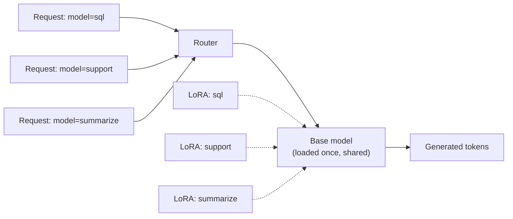

# 6. 部署微调模型

磁盘上一个 LoRA adapter 不是一个可部署的模型。你还得真正把它跑起来——把 `<HTTP request>` 转成 `<generated text>`，并且吞吐和延迟都过得去。有三种部署模式，怎么选取决于你有几个 adapter，以及切换得有多动态。

## 三种部署模式

| 模式 | 何时用 | 取舍 |
|---|---|---|
| **把 LoRA 合并进基座** | 一个 adapter，一个模型，部署简单 | 失去 adapter 切换能力；adapter "焊死"在里面 |
| **adapter 感知部署（vLLM、SGLang）** | 一个基座挂多个 adapter——多租户 SaaS、A/B 测试、按客户分模型 | 部署稍微复杂；约 3 个 adapter 以上才划算 |
| **托管微调 API**（Together、Modal、Fireworks） | 你不想自己跑 GPU | 控制力少；规模大了不划算；artifact 受制于服务商 |

## 模式 1：合并后当普通模型部署

最简单的做法。把基座 + LoRA adapter 拿来，把 adapter 那点数学（`W' = W + B @ A`）折回到基座权重里，把结果存成一个普通的全精度模型。从推理引擎角度看，这就是一个普通模型。

```python
# merge.py — schematic
import torch
from transformers import AutoModelForCausalLM, AutoTokenizer
from peft import PeftModel

BASE = "Qwen/Qwen2.5-3B-Instruct"
ADAPTER = "./qwen3b-myftune-final"
OUT = "./qwen3b-myftune-merged"

# Note: merging a LoRA into a 4-bit base produces a 4-bit merged model with weight quality
# loss from the dequant+merge+requant cycle. For best quality, load the base in fp16 here.
base = AutoModelForCausalLM.from_pretrained(BASE, torch_dtype=torch.float16, device_map="auto")
peft_model = PeftModel.from_pretrained(base, ADAPTER)
merged = peft_model.merge_and_unload()
merged.save_pretrained(OUT, safe_serialization=True)
AutoTokenizer.from_pretrained(BASE).save_pretrained(OUT)
```

然后用 vLLM 像跑任何 HF 模型一样跑：

```bash
vllm serve ./qwen3b-myftune-merged --max-model-len 4096 --gpu-memory-utilization 0.9
```

合适的场景：
- 生产里只有 **一个** 微调模型。
- 不需要运行时切换 adapter。
- 你想要尽可能简单的部署拓扑。

不合适的场景：超过约 3 个 adapter。你会把同一个基座的多份完整副本同时塞进显存——LoRA 设计出来就是为了避免这件事。

## 模式 2：adapter 感知部署（vLLM、SGLang）

vLLM 和 SGLang 都支持 **multi-LoRA** 部署：一个基座加载一次，外加 N 个 LoRA adapter，每个请求通过 header 或请求里的 `model` 字段选哪个 adapter。基座权重在所有请求间共享；只切换那一小块 adapter。

```bash
# vLLM (schematic — flag names may vary by version):
vllm serve Qwen/Qwen2.5-3B-Instruct \
    --enable-lora \
    --lora-modules sql=./qwen3b-sql-adapter \
                   support=./qwen3b-support-adapter \
                   summarize=./qwen3b-summarize-adapter \
    --max-loras 4 --max-lora-rank 32
```

客户端这边：

```python
# point requests at a specific adapter via the model name:
client.chat.completions.create(model="sql", messages=[...])
client.chat.completions.create(model="support", messages=[...])
```



引擎内部对请求做 batching，把对应 adapter 的 `B@A` 应用到每个请求的 hidden state 上。一个 adapter 的吞吐开销很小——每个活跃 LoRA 只多几个百分点的 overhead——内存代价就是 adapter 本身的大小（每个几十 MB）。

这就是 SaaS 多租户、A/B 测试、按客户分模型的部署模式。底层 batching 怎么工作见 [第 10 章](../inference-concurrency)。

### "多 adapter 一基座"的成本账

设想一个 SaaS 产品里有 30 个客户每人一份自己的 7B 微调变体。朴素部署：

```
30 merged 7B models in fp16 = 30 × 14 GB = 420 GB of VRAM
                            -> a small GPU cluster, $$$$
```

走 multi-LoRA：

```
1 base 7B in fp16 = 14 GB
30 adapters × ~50 MB = 1.5 GB
                            -> fits on one A100 80GB with room to spare
```

100 倍的显存效率差距，是按客户微调能在经济上立得住的根本原因。

### 冷启动延迟

如果一个请求要的 adapter 当前不在显存里，得从磁盘加载。典型开销：

- 本地 SSD 上的 adapter：10–50 ms
- 远程对象存储（S3、GCS）上的 adapter：200–500 ms

vLLM 这种引擎会在显存里维护一个最近使用 adapter 的 LRU 缓存（`--max-loras N`）。根据你的流量在一分钟里命中多少活跃 adapter 来调 `N`；冷启动对偶尔用到的 adapter 没问题，对热的 adapter 就不能接受。

## 模式 3：托管微调 API

好几家厂商提供"上传你的数据集，拿回一个模型 endpoint"的服务：**Together**、**Modal**、**Fireworks**、**Replicate**，加上闭源 API 厂商自己的微调服务（OpenAI，Anthropic 在 beta）。

合适的场景：
- 在试微调，还没准备好自己跑基础设施。
- 量小——你不想常驻一张 GPU。
- 想按 token 计费而不是按 GPU 小时计费。

不合适的场景：
- 量大——每个微调每月超过 100 万请求时，自己跑通常更便宜。
- 严格的数据驻留 / 隐私要求（你不想训练数据离开你的基础设施）。
- 想完全控制推理栈（自定义 sampler、特殊量化、multi-LoRA 拓扑）。

一个团队合理的路径：先在托管 API 上做原型 → 评估质量 → 如果效果好且量上来了，再迁到自托管 multi-LoRA 部署。

## 微调模型还能做 prompt cache 吗？

微调模型仍然能从 prompt cache 受益（[第 9 章](../kv-cache) 讲 KV cache 机制）。KV cache 是（模型权重，输入 token）的函数——同一个基座上不同的 LoRA 会产生各自的 KV cache，但同一个 adapter 之内、跨请求共享的 system prompt 仍然可缓存。大多数 multi-LoRA 部署栈把 cache 的 key 设成 `(adapter_id, prompt_prefix)`。

## 一张总结表

| 模式 | 每个微调额外占的显存 | adapter 切换 | 适合 |
|---|---|---|---|
| 合并后的基座 | 又一份基座大小 | 没有（要重新加载模型） | 1 个微调 |
| Multi-LoRA（vLLM / SGLang） | adapter 大小（~50 MB） | 每请求切，~毫秒级 | 2–100 个微调 |
| 托管 API | 服务商的事 | 服务商的事 | 早期实验，低量 |

最后一句关于**版本管理**：把你的 adapter artifact 当 Docker image 那样对待——打 tag、做版本、放对象存储里，并且写明每个 adapter 是针对哪个基座版本训出来的。这件事在上游基座第一次发新版本时会变得性命攸关——见下一节。

下一节: [生产坑 →](./production-pitfalls)
