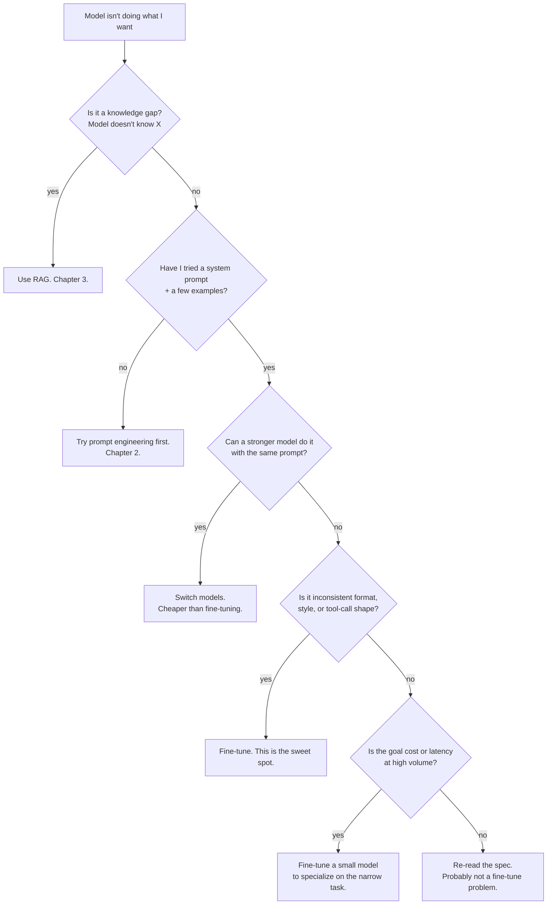

# 1. 何时该微调

微调是 LLM 工具箱里被滥开处方最严重的那一个。绝大多数"我们需要微调"的需求其实是知识问题（该上 RAG）、prompt 问题，或者选模型选错了。在你预订任何一张 GPU 之前，先把决策树走完。

## 决策树



层级是 **知识 > prompt > 模型 > 微调**。每往上跳一级，工程时间大约要贵 10 倍。先在便宜的那一级把时间花够，再往上升级。

## "行为 vs. 知识" 这条规矩，再说一次

[第 3 章 §1](../embeddings-and-rag/why-rag) 用一张表讲过。把它内化成一句话：

- **知识问题**：模型没那个事实。→ RAG。建索引按小时算，更新按分钟算，引用还是免费送的。
- **行为问题**：模型有事实但是输出的形态、语气、可靠性不对。→ 先 prompt 工程，prompt 搞不定再上微调。

微调*能*把知识塞进去，但是有损的、不可审计的——事实被纠缠在几十亿个权重里，你没法只更新其中一个事实而不重训，模型也没法引用它在哪学到这个事实。事实的事，RAG 严格更优。

## 微调真正能赢的场景

| 任务类型 | 微调有用是因为…… |
|---|---|
| 风格 / 语气 / 人设 | 行为是覆盖整个输出分布的，不是只有第一句话像。 |
| 输出格式合规 | schema 约束生成能搞定 JSON；微调能搞定更怪的格式（自定义 DSL、结构化散文、固定模板）。 |
| 窄分类任务 | 一个微调过的 3B 在某个具体任务上能追平前沿模型，推理成本却不到 1%。 |
| Tool-use 格式合规 | 如果你的工具协议比较奇葩（自定义 JSON 形态、项目特有的函数签名），微调能把格式烧进去。见 [第 2 章 §6](../llm-apis-and-prompts/tool-use)。 |
| 拒答策略调整 | 一些合法领域（安全研究、医疗、法律）会被现成模型直接拒答；微调可以挪一下边界。见 [第 2 章 §9](../llm-apis-and-prompts/failure-modes)。 |
| 领域推理风格 | 法律备忘录腔、医生病历腔、内部 Slack 腔。prompt 里很难抓住，500 个例子就能学会。 |

## 微调会输的场景

| 任务类型 | 微调失败是因为…… |
|---|---|
| 开放领域知识问答 | 事实会过期；不能引用；更新就要重训。RAG 赢。 |
| 时效性 | 三月微调出来的模型对四月的事是错的。重训贵；重建索引不贵。 |
| 通用推理 | 如果基座模型对你这个领域根本就不会推理，再多 SFT 也变不出真本事——你在教鱼拉小提琴。换个更强的基座。 |
| 例子少于 100 条的任务 | 过拟合的风险压过了任何信号。 |
| 你没有 eval set | 你不会知道微调有没有起作用、起的是好作用还是坏作用。先把 eval 建起来。 |

## 成本权衡

微调有一笔固定的前期成本（训练算力 + 工程时间），自托管之后每次推理几乎是免费的。前沿 API 推理前期几乎没成本，但每个请求要付钱、付到永远。盈亏平衡大致是：

```
fine-tune cost per month  ≈  training amortization + GPU hours for serving + eng time
frontier API cost per month  ≈  requests × (input + output) × per-token price
```

一条现实里的经验：**在窄任务上每月约 100 万 + 请求时**，微调过的开源小模型（3B、7B）的总成本通常会赢前沿 API。低于这个量，工程时间收不回；高于这个量，微调赢得很彻底。

这也解释了为什么 **垂直 SaaS** 公司会做微调，而消费级聊天 app 一般不做：垂直 SaaS 的任务是窄而高量的；消费级聊天 app 的任务是开放的，前沿模型的广度仍然重要。

## 哪些情况下你不应该微调

一份"停下来想清楚"的清单：

- **你只有不到 100 条高质量标注样本。** 模型会把它们背下来，不会泛化。
- **目标是时效性或者事实覆盖。** 那是 RAG 的问题。
- **你没有留出来的 eval set。** 先把 eval 做出来；不然"微调到底有没有用"是一个无解的问题。
- **你的模型还没地方部署**（没有推理基础设施、没有 GPU 预算、没有部署计划）。微调产出的是一个模型工件；如果你没地方上线，这个工件就是装饰品。
- **prompt 工程 + 一个更强的基座已经能拿到 90% 的效果。** 最后那 10% 很少值得花几周做微调项目。

## 承上启下

如果走到这里你还想微调——好。下一节讲的就是让微调在消费级硬件上变得可行的算法：LoRA 和它的 4-bit 表亲 QLoRA。

下一节: [LoRA 与 QLoRA →](./lora-and-qlora)
