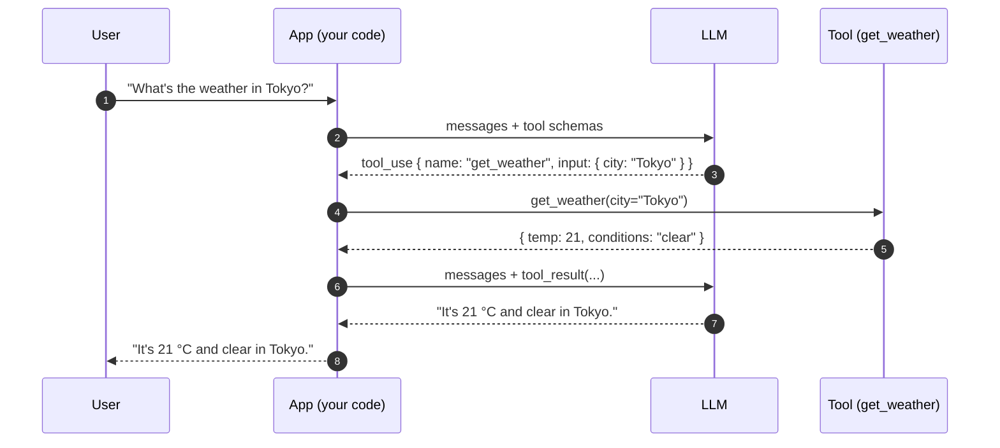
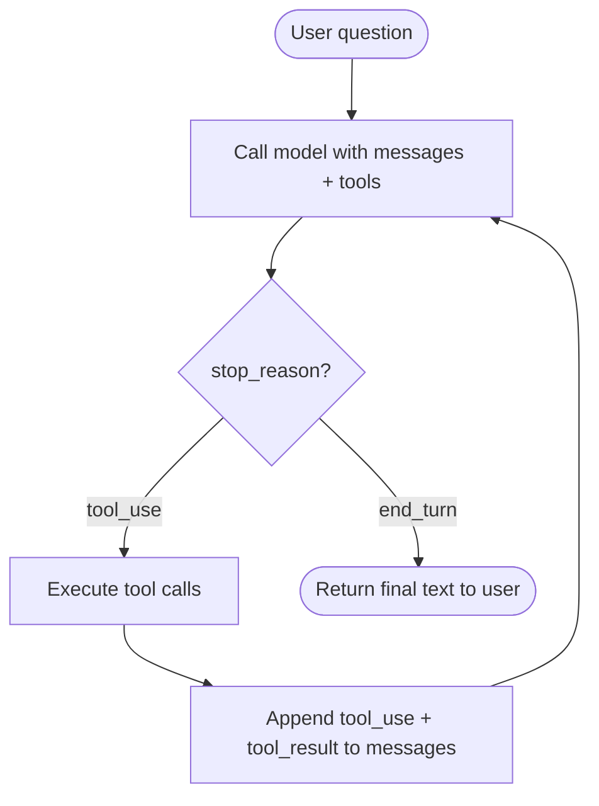

# 6. Function Calling / 工具调用

只能吐文本的模型是和外部世界隔绝的。它读不了你的数据库，碰不了你的 API，跑不了一个计算器，看不到现在几点。工具调用——也叫 function calling——就是你让模型与你掌控的代码互动的协议。

这一节为第 4 章（Agent）打底。请认真看。

## 协议

工具调用是一支轮流舞：

1. 你声明一组工具（函数）以及它们的 input schema。
2. 模型在它判断需要调用某个工具时，吐出一个结构化的 `tool_use` block：「我想用 `{"city": "Tokyo"}` 调 `get_weather`」。
3. **你**——你的代码，不是模型——拿这些参数去执行那个函数。
4. 你把函数返回值作为一条 `tool_result` 消息追加到 messages 数组里。
5. 你拿更新后的 messages 再次调用模型。
6. 模型接着续写：要么再调一个工具，要么产出最终的文本回答。

模型自己从不执行任何东西。它只**提议**调用。**带手的是你的客户端。**

## 一个完整的生命周期

一个返回某城市当前天气的工具。

```python
import json
import anthropic

client = anthropic.Anthropic()

# 1. Declare the tool.
tools = [{
    "name": "get_weather",
    "description": "Get the current weather for a city.",
    "input_schema": {
        "type": "object",
        "properties": {
            "city": {"type": "string", "description": "City name, e.g. 'Tokyo'"},
            "unit": {"type": "string", "enum": ["c", "f"], "default": "c"},
        },
        "required": ["city"],
    },
}]

# 2. The actual function the tool resolves to (model never sees this).
def get_weather(city: str, unit: str = "c") -> dict:
    # Pretend this hits an API.
    return {"city": city, "unit": unit, "temp": 21, "conditions": "clear"}

# 3. First call — user asks a question.
messages = [
    {"role": "user", "content": "What's the weather in Tokyo right now?"},
]

resp = client.messages.create(
    model="claude-sonnet-4-6",
    max_tokens=512,
    tools=tools,
    messages=messages,
)

# 4. Inspect the response. If stop_reason == "tool_use", we have work to do.
print(resp.stop_reason)  # "tool_use"
for block in resp.content:
    if block.type == "tool_use":
        print(block.name, block.input)
        # -> "get_weather" {"city": "Tokyo"}
```

到这一刻，你的 messages 数组从概念上长这样：

```python
[
    {"role": "user",      "content": "What's the weather in Tokyo right now?"},
    {"role": "assistant", "content": [
        {"type": "tool_use", "id": "toolu_01ABC", "name": "get_weather",
         "input": {"city": "Tokyo"}},
    ]},
]
```

接下来你执行工具，把结果回喂：

```python
# 5. Append the assistant's tool_use to history (replaying it next call).
messages.append({"role": "assistant", "content": resp.content})

# 6. Execute the tool yourself.
tool_use = next(b for b in resp.content if b.type == "tool_use")
result = get_weather(**tool_use.input)

# 7. Append the result as a tool_result message.
messages.append({
    "role": "user",
    "content": [{
        "type": "tool_result",
        "tool_use_id": tool_use.id,
        "content": json.dumps(result),
    }],
})

# 8. Call the model again. It now has the result and produces a final answer.
final = client.messages.create(
    model="claude-sonnet-4-6",
    max_tokens=512,
    tools=tools,
    messages=messages,
)
print(final.content[0].text)
# -> "It's currently 21 °C and clear in Tokyo."
```

最终的 messages 数组完整是这样：

```python
[
    {"role": "user",      "content": "What's the weather in Tokyo right now?"},
    {"role": "assistant", "content": [TextBlock?, ToolUseBlock("get_weather", {city: "Tokyo"})]},
    {"role": "user",      "content": [ToolResultBlock(tool_use_id, '{"temp": 21, ...}')]},
    {"role": "assistant", "content": "It's currently 21 °C and clear in Tokyo."},
]
```

两次模型调用。中间一次工具执行。模型从未碰过你的天气 API ——是你的代码碰的，模型只是拿到 JSON 回来。

## 用时序图看这个生命周期



每一根箭头要么是网线上的数据，要么是你进程里的一次函数调用。模型被动地坐在中间——它没法自己横跨这张图。它只能提议工具调用，由 app 来分发。

## 从一次调用到一个循环

如果模型看到第一个结果之后还想调第二个工具呢？它再吐一个 `tool_use` block 就行。如果它想并行调三个工具呢？有些提供商原生支持这一点（响应里包含多个 `tool_use` block）。如果它想一直跑下去直到任务完成呢？

你把这整件事用一个 `while` 循环包起来：



这就是一个 agent。

agent 不过是套在工具调用协议外面的一个 while 循环。模型提议工具调用，你的代码执行它们，结果回到 messages 数组，然后迭代——直到模型说"我搞完了"（`stop_reason: "end_turn"`），或者你撞到某个安全预算（最大迭代数、最大墙钟时间、最大成本）。

我们会把 agent 讲深——编排模式、并行、错误恢复、规划循环、多 agent 系统——放在**第 4 章**。你刚学的这个协议就是全部地基。其余一切都是在它上面的工程。

下一节: [流式输出 →](./streaming)
