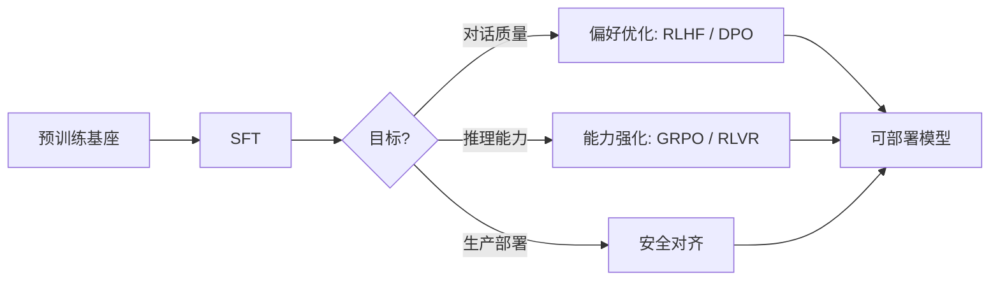

# 1. 后训练全景

一张图看懂从预训练到部署。

## 后训练的定义与边界

后训练是指在预训练（Pre-Training）完成之后，通过额外的训练步骤让模型具备特定能力的所有技术的总称。预训练教会模型"语言是什么"，后训练教会模型"该怎么用语言"。

一个常见的误解是把后训练等同于"微调"。实际上，微调（Fine-Tuning）只是后训练的一个子集。现代后训练是一个多阶段、可组合的技术栈，不同阶段解决不同问题。

## 四个阶段的模块化栈

当前业界的后训练流程已经形成了一套相对成熟的模块化架构：

| 阶段 | 目标 | 典型方法 | 解决的问题 |
| --- | --- | --- | --- |
| 监督微调（SFT） | 指令遵循 | 指令数据 + 有监督训练 | 模型不会对话、不遵循格式 |
| 偏好优化 | 价值对齐 | RLHF / DPO / KTO | 模型回答质量不稳定、不符合人类偏好 |
| 能力强化 | 推理与规划 | GRPO / RLVR | 模型不会深度思考、逻辑链薄弱 |
| 安全对齐 | 无害与可控 | 红队 + 安全 RLHF + 规则约束 | 模型可能生成有害、虚假或偏见内容 |

这四个阶段并非必须全部执行，也不一定严格按顺序。一个轻量级的聊天助手可能只需要 SFT + DPO；一个推理模型可能需要 SFT + GRPO + 安全对齐。选择哪些模块、怎么组合，取决于你的目标。

## 为什么后训练决定了模型的最终体验

InstructGPT 的实验给出了一个惊人的数字：经过后训练的 1.3B 参数模型，在人类评估中优于未经后训练的 175B 参数 GPT-3。这说明后训练的边际收益远大于单纯增加预训练规模。

到 2025-2026 年，行业共识已经从"谁的模型更大"转向了"谁的后训练更好"。DeepSeek-R1 用 GRPO 训练出了接近 o1 水平的推理能力，Meta 的 Llama 系列每一代的核心改进都集中在后训练环节。

> **检查点**：你能说出后训练四个阶段各自解决什么问题吗？如果不能，回看上面的表格。

下一节：[监督微调（SFT）](./sft)
