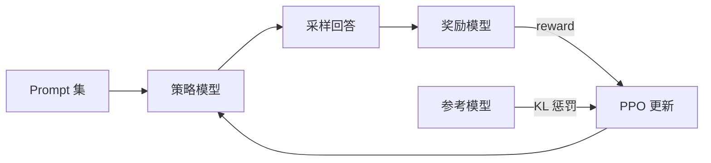

# 3. RLHF

用人类偏好训练模型。

## SFT 的天花板

[SFT](./sft) 能教会模型对话，但它有一个根本局限：对于同一个问题，可能存在多种不同质量的回答，而 SFT 只能教模型模仿"示例回答"，无法告诉模型"这个回答比那个好"。

RLHF（Reinforcement Learning from Human Feedback）的核心贡献就是引入了"比较"这个维度——不是告诉模型标准答案，而是让人类标注员对多个回答进行排序，然后用强化学习让模型学会生成"被人类偏好的"回答。

## InstructGPT 的三阶段方法

2022 年 OpenAI 发表的 InstructGPT 论文奠定了 RLHF 的工业化基础。它的三阶段流程至今仍是理解后训练的最佳起点：

**阶段一：SFT**。用约 13000 条人工编写的高质量指令-回复数据微调 GPT-3。

**阶段二：训练奖励模型（RM）**。让模型对同一个问题生成多个回答，由人类标注员对这些回答排序。用排序数据训练一个奖励模型，它的输出是一个标量分数，表示"这个回答有多好"。

**阶段三：PPO 优化**。把奖励模型当作"环境"，用 PPO（Proximal Policy Optimization）算法让语言模型生成更高奖励的回答。同时用 KL 散度惩罚防止模型偏离太远。



## PPO 的核心机制

PPO 是 RLHF 中最常用的强化学习算法。它的核心思想是"小步更新"：每次更新策略时，限制新旧策略之间的差距，避免灾难性的大幅偏移。

PPO-CLIP 的目标函数通过裁剪概率比率来实现这一点：当新策略相对旧策略的变化超过阈值（通常 epsilon=0.2），梯度会被截断。这让训练过程更加稳定。

```
ratio_t        = pi_new(a_t | s_t) / pi_old(a_t | s_t)
clipped_ratio  = clip(ratio_t, 1 - epsilon, 1 + epsilon)
L_PPO          = -E[ min(ratio_t * A_t, clipped_ratio * A_t) ]

总目标 (RLHF):
L = L_PPO  -  beta * KL(pi_new || pi_ref)
```

KL 项是让后训练之后的模型不至于"忘了怎么写正常文本"的关键——它保证策略不会偏离 SFT 参考太远。

## RLHF 的工程挑战

RLHF 在理论上很优雅，但工程实践中困难重重：

- **需要同时维护多个模型**：语言模型、奖励模型、参考模型、价值网络，GPU 显存需求巨大
- **训练不稳定**：奖励模型的偏差会被 RL 过程放大，导致"奖励黑客"（reward hacking）——模型找到高奖励但低质量的捷径
- **超参数敏感**：KL 惩罚系数、学习率、采样温度等参数需要仔细调节
- **人工标注成本高**：高质量的偏好排序数据需要经过培训的标注员

这些挑战催生了后续更简单的方法，比如 [DPO](./dpo)。

> **检查点**：奖励模型的作用是什么？如果奖励模型本身不准确，会发生什么？

下一节：[DPO 及其变体](./dpo)
