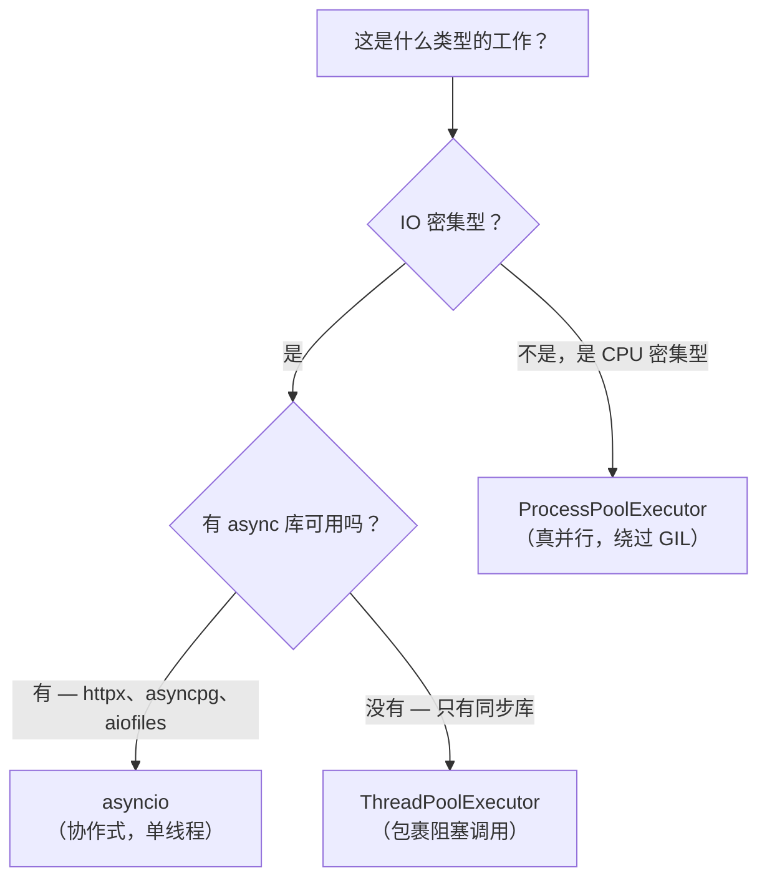

# 4. 并发模型

第 3 章给你看了 `async`/`await` 语法。这一章解释 Python 并发模型*为什么*长这个样子，以及怎么针对不同的任务选对工具。

对 TS 开发者来说最容易迷惑的地方：Python 有三种并发原语（`asyncio`、`threading`、`multiprocessing`），选哪个取决于你在做*什么类型*的工作。Node.js 里你几乎不用想这个——事件循环处理 IO，Worker Threads 处理 CPU，差不多就这样。Python 做了一样的区分，只是把三层都直接暴露给你了。

## 4.1 选择决策树

在讲原理之前，先给出你每次都会用到的判断规则：



## 4.2 GIL——问题的根源

CPython（Python 的参考实现）用引用计数来管理内存：每个对象记录有多少地方持有对它的引用；计数归零就释放内存。

如果两个线程同时修改同一个对象的引用计数，计数就会损坏——造成内存泄漏或崩溃。有两种解决方案：

1. **细粒度的每对象锁**——安全，但每次属性访问都要加解锁，开销巨大。
2. **给整个解释器加一把大锁**——全局解释器锁（GIL）。简单，单线程性能很好。

CPython 选了第二种。后果如下：

```
线程 A 执行 Python 字节码 ──────────────────────► 运行中
线程 B 等待 GIL           ── 被 GIL 阻塞 ───────► 等待中

当线程 A 遇到网络/磁盘等待时：
  线程 A 释放 GIL，挂起等待 IO
  线程 B 获取 GIL，执行 Python 代码
  线程 A 等 IO 完成后重新竞争 GIL
```

**实际影响：**

| 工作类型 | GIL 的影响 |
|----------|------------|
| IO 密集（网络、磁盘、数据库） | 几乎没有——等 IO 期间会释放 GIL |
| CPU 密集（纯 Python 计算/解析） | 严重——多线程无法并行执行 Python |
| C 扩展（NumPy、PyTorch） | 通常没问题——C 代码计算期间会释放 GIL |

## 4.3 asyncio——事件循环

`asyncio` 是 Python 里最接近 Node.js 事件循环的东西。它在单线程上运行，使用*协作式*调度：协程在每个 `await` 点主动把控制权让出来，让其他协程得以运行。

```python
import asyncio
import httpx

async def fetch(client: httpx.AsyncClient, url: str) -> str:
    response = await client.get(url)  # 在这里让出控制权，其他协程可以运行
    return response.text

async def main() -> None:
    urls = ["https://httpbin.org/delay/1"] * 5

    async with httpx.AsyncClient() as client:
        # asyncio.gather 并发运行全部 5 个——总耗时约 1 秒，而不是 5 秒
        results = await asyncio.gather(*[fetch(client, url) for url in urls])

    print(f"拿到 {len(results)} 个响应")

asyncio.run(main())  # 启动事件循环；相当于 Node.js 里隐式启动的那步
```

**asyncio vs Node.js 对比：**

| | Node.js | Python asyncio |
|--|---------|---------------|
| 启动 | 事件循环始终在跑 | 需要 `asyncio.run()` |
| 异步函数 | `async function` → 返回 `Promise` | `async def` → 返回协程 |
| 并发运行 | `Promise.all([...])` | `asyncio.gather(...)` |
| 竞速 | `Promise.race([...])` | `asyncio.wait(..., return_when=FIRST_COMPLETED)` |
| 后台任务 | fire-and-forget `someAsync()` | `asyncio.create_task(coro())` |
| 超时 | `AbortController` / `Promise.race` | `asyncio.wait_for(coro(), timeout=5)` |

```python
# 后台任务——等价于 Node.js 里的 fire-and-forget
async def main() -> None:
    task = asyncio.create_task(slow_operation())  # 立即启动，不阻塞
    
    await asyncio.sleep(0)   # 让出一次，让任务有机会开始
    print("做其他事情")
    
    result = await task      # 需要结果时再等它
```

**同步/异步的边界：**

`await` 只能在 `async` 函数里调用。`asyncio.run()` 是从同步代码进入异步世界的唯一入口。

```python
# 错误——从同步代码调用 async 函数，只会拿到协程对象，什么都没有执行
result = fetch_user("1")           # 协程对象——还没有运行！

# 正确——顶层入口点
result = asyncio.run(fetch_user("1"))

# 正确——在 async 函数内部，始终用 await
async def handler():
    result = await fetch_user("1")
```

## 4.4 threading——用同步库做 IO 并行

`threading` 创建操作系统线程。由于 GIL，它们无法并行执行 Python 字节码，但在 IO 等待期间 GIL *会被释放*——所以多个线程等待网络请求是真正并发的。

当你需要并发调用同步（非 async）库时用 threading。

```python
from concurrent.futures import ThreadPoolExecutor
import httpx  # 同步客户端

def fetch_sync(url: str) -> str:
    return httpx.get(url).text   # 阻塞此线程；等网络期间 GIL 会释放

urls = ["https://httpbin.org/delay/1"] * 5

with ThreadPoolExecutor(max_workers=5) as pool:
    results = list(pool.map(fetch_sync, urls))  # 总耗时约 1 秒，而不是 5 秒
```

`ThreadPoolExecutor` 是高层 API。它在底层维护一个线程池，把工作项分发给线程。除非需要精细控制，不要直接用 `threading.Thread`。

## 4.5 multiprocessing——真正的 CPU 并行

`multiprocessing` 创建独立的操作系统进程。每个进程有自己的 Python 解释器和自己的 GIL，因此可以在不同 CPU 核上并行执行 Python 代码。这是目前在 CPython 上获得真正 CPU 并行的唯一方式。

```python
from concurrent.futures import ProcessPoolExecutor
import os

def cpu_heavy(n: int) -> int:
    return sum(i * i for i in range(n))   # 纯 Python 计算

chunks = [5_000_000] * os.cpu_count()

with ProcessPoolExecutor() as pool:
    results = list(pool.map(cpu_heavy, chunks))
```

**你必须知道的代价：**

- 启动一个进程需要约 100 ms——始终用进程池，不要每个任务都启动一个新进程。
- 参数和返回值跨进程边界需要序列化（pickle），对象必须是可 pickle 的。
- Lambda 和局部函数**不能** pickle——用模块顶层定义的函数。

```python
# 错误——lambda 不能被 pickle
with ProcessPoolExecutor() as pool:
    results = pool.map(lambda x: x * 2, data)  # PicklingError!

# 正确——顶层函数
def double(x: int) -> int:
    return x * 2

with ProcessPoolExecutor() as pool:
    results = list(pool.map(double, data))
```

## 4.6 同步与异步的互相调用

常见场景：你在写 async 代码，但需要调用一个阻塞的同步库，又不想卡住事件循环。

```python
import asyncio
from concurrent.futures import ThreadPoolExecutor

_executor = ThreadPoolExecutor()

async def call_blocking_lib(arg: str) -> str:
    loop = asyncio.get_event_loop()
    # run_in_executor 把阻塞调用转移到线程池
    # 事件循环保持响应，不被卡住
    result = await loop.run_in_executor(_executor, blocking_library_call, arg)
    return result
```

反过来——从同步代码调用 async——用 `asyncio.run()`：

```python
def sync_entry_point() -> None:
    result = asyncio.run(async_function())   # 阻塞直到完成
```

## 4.7 快速参考

| | asyncio | ThreadPoolExecutor | ProcessPoolExecutor |
|--|---------|-------------------|---------------------|
| 并行方式 | 协作式（1 个线程） | OS 调度（GIL 限制 Python 代码） | 真并行（N 个进程） |
| 最适合 | 有 async 库的 IO 任务 | 同步/阻塞库的 IO 任务 | CPU 密集型计算 |
| 启动开销 | 可忽略 | 低 | 高（每进程约 100 ms） |
| 共享状态 | 天然共享（同一线程） | 需要 `threading.Lock` | 需要 IPC（Queue、管道） |
| 是否需要 pickle | 否 | 否 | 是（参数和返回值） |

## 4.8 Free-threaded Python（3.13+）

Python 3.13（2024 年 10 月）提供了实验性的"free-threaded"构建版本——编译时去掉 GIL（PEP 703）。Python 3.14（2025 年 10 月）将其升级为正式支持，但仍是可选的，并非默认。

实际上，生产环境仍然运行带 GIL 的版本。生态库（NumPy、Cython、各种扩展）正在逐步适配，但不兼容问题仍然存在。再过几年，`ThreadPoolExecutor` 也许真的能在不用 `multiprocessing` 的情况下获得 CPU 级别的并行。在那之前，§4.1 的决策树依然适用。

---

下一节: [模块与标准库 →](./modules-and-stdlib)
